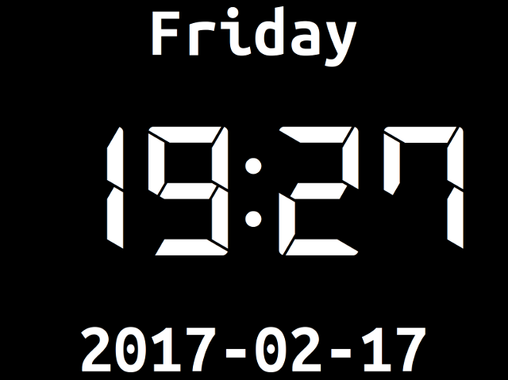

# walltime
Misusing a Raspberry Pi and monitor as a wall-clock.

## Instructions
* Install base Raspian on a Raspberry Pi
* Change pi's password to something sensible

    sudo timedatectl set-timezone Europe/London
    sudo timedatectl set-ntp true
    git clone https://github.com/cillian64/walltime.git
    cd walltime
    git submodule update --init
    mkdir ~/.fonts; cp -r DSEG/fonts/DSEG7-Modern ~/.fonts/
    fc-cache -f -v
    ./walltime.py
